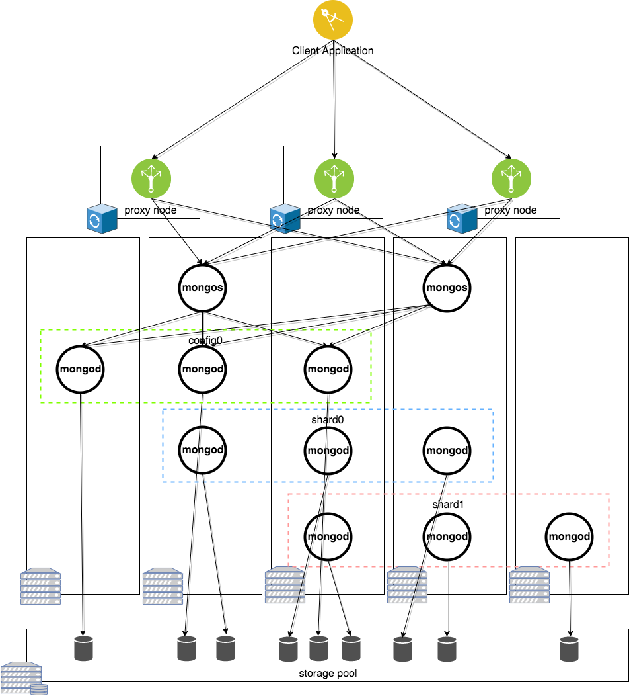

# Deploy Highly Available MongoDB on IBM Cloud Private platform

Recently, we were asked several times on how to deploy database systems like [MongoDB](https://www.mongodb.com/) on [IBM Cloud Private](https://www.ibm.com/cloud-computing/products/ibm-cloud-private/) (ICP) Kubernetes platform, and ensure the deployment is highly available and scalable. The research directed us to use a Kubernetes community stable Helm chart  [mongodb-replicaset](https://github.com/kubernetes/charts/tree/master/stable/mongodb-replicaset). This chart uses a Kubernetes StatefulSet to create a single scalable MongoDB [Replica Set](https://docs.mongodb.com/manual/core/replica-set-architectures/) for high availability. The persistence is built using of the Kubernetes [PersistentVolume](https://kubernetes.io/docs/concepts/storage/persistent-volumes/). The database itself exposed as a Kubernetes Headless service. This works great if the database will only be used by application deployed in the same Kubernetes cluster, but it poses a challenge if you try to expose the MongoDB as an external service or even build a managed DBaaS solution.

The first challenge is how to expose the MongoDB replica set as a Service. It can't be just simply exposed as Kubernetes LoadBalancer or NodePort based service, because the MongoDB internally uses the FQDN of each member in the cluster to handle Primary/Slave election. Additionally, MongoDB clients need to be able to access all members using their hostnames, which becomes complex as you scale out the database.  

After some research and experiments, we have a solution using [mongos](https://docs.mongodb.com/manual/reference/program/mongos/) to deploy a highly available [MongoDB Sharded Cluster](https://docs.mongodb.com/manual/core/sharded-cluster-components/) using the `mongodb-replicaset` chart to solve the problem.  

## Architecture



- MongoDB is deployed as a sharded cluster.  Each `mongodb-replicaset` represents one shard of the database.  The database can be scaled out by deploying additional shards.
- Each shard contains 3 pods deployed as a Kubernetes [StatefulSet](https://kubernetes.io/docs/concepts/workloads/controllers/statefulset/), and each pod contains a PersistentVolume stored on storage system.  Follow this [documentation](https://docs.mongodb.com/manual/core/replica-set-architectures/) to determine how many members to deploy in each Replica Set; in our example we deploy the default of 3.  *NOTE: don't confuse MongoDB ReplicaSet with Kubernetes [ReplicaSet](https://kubernetes.io/docs/concepts/workloads/controllers/replicaset/), they are different!*
- The `mongodb-replicaset` chart is also deployed as a [Config Server ReplicaSet](https://docs.mongodb.com/manual/core/sharded-cluster-config-servers/) which stores the metadata of the sharded cluster.
- `mongos` is a query router that performs aggregations on behalf of the client.  When the client requests data by key, `mongos` will call the appropriate shards that contain the data using the metadata stored in the Config Server ReplicaSet, and return the query results to the client on behalf of the sharded cluster.  We have deployed `mongos` with two replicas for High Availability and exposed it as a NodePort service to clients outside of the ICP cluster.

## Deployment Guide

### Pre-requisites

- IBM Cloud Private installation with at least three worker nodes
- Persistent Storage, such as NFS or GlusterFS.  In our case, we have enabled GlusterFS with a Dynamic Storage Class called `gluster-repl2` which dynamically provisions replicated volumes in a GlusterFS cluster.
- [kubectl](https://kubernetes.io/docs/tasks/tools/install-kubectl/) CLI
- [helm](https://helm.sh/) CLI
- [MongoDB Shell](https://docs.mongodb.com/getting-started/shell/client/) client CLI

### Steps

Follow the instruction below to setup the instance:

1. Deploy the Config Server ReplicaSet using the following Helm command:

   ```bash
   helm install \
     --name mongo-cfg \
     --set persistentVolume.storageClass=gluster-repl2 \
     --set replicaSet=config0 \
     --set configmap.replication.replSetName=config0 \
     --set configmap.sharding.clusterRole=configsvr \
     stable/mongodb-replicaset
   ```

   This creates a MongoDB ReplicaSet named `config0` with 3 members, with a 10GiB volume for each member, and each member will listen on default port 27017.  The pods will be named `mongo-cfg-mongodb-replicaset-<#>`.  A headless service is created and the individual pods can be reachable inside the cluster from any other cluster using an FQDN like `mongo-cfg-mongodb-replicaset-<#>.mongo-cfg-mongodb-replicaset.default.svc.cluster.local`

2. Deploy the first shard, `shard0`, using the following Helm command:

   ```bash
   helm install \
     --name mongo-shard0 \
     --set persistentVolume.storageClass=gluster-repl2 \
     --set replicaSet=shard0 \
     --set configmap.replication.replSetName=shard0 \
     --set configmap.sharding.clusterRole=shardsvr \
     stable/mongodb-replicaset
   ```

   This creates a MongoDB ReplicaSet named `shard0` with 3 members, with a 10GiB volume for each member, and each member will listen on default port 27017.  The pods will be named `mongo-shard0-mongodb-replicaset-<#>`.  A headless service is created and the individual pods can be reachable inside the cluster from any other cluster using an FQDN like `mongo-shard0-mongodb-replicaset-<#>.mongo-shard0-mongodb-replicaset.default.svc.cluster.local`

   Note that the above step can do done as many times as necessary to scale out the storage horizontally.

3. Create a `mongos` deployment using the yaml in the `kubernetes/` folder in this project.  Before executing this command, check `kubernetes/mongos.yaml` to make sure the configured hostnames in the Config Server ReplicaSet are correct.

   ```bash
   kubectl create -f kubernetes/
   ```

   This creates a `mongos` deployment that connects to the `config0` ReplicaSet to store the metadata for the sharded cluster.  A NodePort service is created, check the NodePort number to connect the MongoDB shell in the next step.

   ```bash
   kubectl get service mongos
   NAME        CLUSTER-IP   EXTERNAL-IP   PORT(S)           AGE
   mongos      10.0.0.7     <nodes>       27017:32713/TCP   1d
   ```

4. Use the `mongo` shell to connect to the `mongos` process through the ICP proxy node.  In our case, the ICP proxy virtual IP is 172.16.40.189.

   ```bash
   mongo --host 172.16.40.189 --port 32713
   ```

   Add the `shard0` using the following the FQDN of the members in the `shard0` ReplicaSet.  Note that just one of the members in the ReplicaSet needs to be specified here, but we specified all three for completeness.

   ```
   mongos> sh.addShard("shard0/mongo-shard0-mongodb-replicaset-0.mongo-shard0-mongodb-replicaset.default.svc.cluster.local:27017,mongo-shard0-mongodb-replicaset-1.mongo-shard0-mongodb-replicaset.default.svc.cluster.local:27017,mongo-shard0-mongodb-replicaset-2.mongo-shard0-mongodb-replicaset.default.svc.cluster.local:27017")
   { "shardAdded" : "shard0", "ok" : 1 }
   ```

   Verify the shard has been added:

   ```
   mongos> sh.status()
--- Sharding Status ---
  sharding version: {
        "_id" : 1,
        "minCompatibleVersion" : 5,
        "currentVersion" : 6,
        "clusterId" : ObjectId("5a3876afe4db1e334a990972")
}
  shards:
        {  "_id" : "shard0",  "host" : "shard0/mongo-shard0-mongodb-replicaset-0.mongo-shard0-mongodb-replicaset.default.svc.cluster.local:27017,mongo-shard0-mongodb-replicaset-1.mongo-shard0-mongodb-replicaset.default.svc.cluster.local:27017,mongo-shard0-mongodb-replicaset-2.mongo-shard0-mongodb-replicaset.default.svc.cluster.local:27017",  "state" : 1 }
  active mongoses:
        "3.4.10" : 1
 autosplit:
        Currently enabled: yes
  balancer:
        Currently enabled:  yes
        Currently running:  no
                Balancer lock taken at Mon Dec 18 2017 21:17:19 GMT-0500 (EST) by ConfigServer:Balancer
        Failed balancer rounds in last 5 attempts:  0
        Migration Results for the last 24 hours:
                No recent migrations
  databases:
   ```

   Repeat this last step for each shard created in ICP.

## Test the deployment

1. Connect to the `mongos` instance using the NodePort.

   ```bash
   mongo --host 172.16.40.189 --port 32713
   ```

2. Create a collection in the `test` database, and insert a document.

   ```
   mongos> use test
   switched to db test

   mongos> db.testCollection.insertOne(
   ... {
   ... name: "jkwong",
   ... type: "test"
   ... }
   ... )
   {
        "acknowledged" : true,
        "insertedId" : ObjectId("5a38829e9c3e96142ba69214")
   }
   ```

3.  Get collection info to verify the collection now exists:

  ```
  mongos> db.getCollectionInfos()
  [
          {
                  "name" : "testCollection",
                  "type" : "collection",
                  "options" : {

                  },
                  "info" : {
                          "readOnly" : false
                  },
                  "idIndex" : {
                          "v" : 2,
                          "key" : {
                                  "_id" : 1
                          },
                          "name" : "_id_",
                          "ns" : "test.testCollection"
                  }
          }
  ]
    ```

4. Verify that the document exists

   ```
   mongos> db.testCollection.find({name: "jkwong"})
   { "_id" : ObjectId("5a38829e9c3e96142ba69214"), "name" : "jkwong", "type" : "test" }
   ```

## Other consideration

TBD
